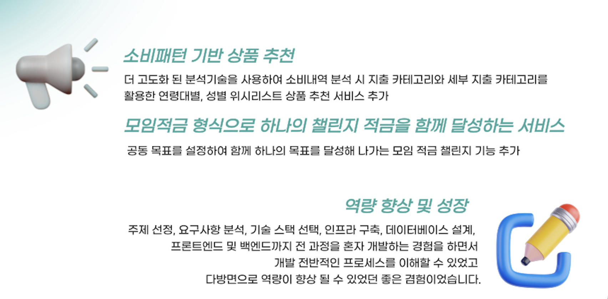

# HANAWISHBANK

# 1. 프로젝트 소개

### 1-1. 프로젝트 기획 배경 및 목표

### 1-1-1. 기획 배경

- FOMO, YOLO, 스몰 럭셔리 소비, 소확행 소비,플렉스 소비 등개인의 가치와 경험 행복을 중요시하는 소비유형들이 인기를 얻고 있지만 이는 자칫하면 과소비로 이어지거나 무분별한 소비로 이어질 수 있는 소비로, 이러한 형태들이 많이 보이고 있는 것을 저는 문제 상황으로 인식하였고 이러한 소비가 나타나는 원인을 파악하여보았습니다.

- 그 결과 즉각적인 만족과 선망,마케팅 전략과 유인요소, 소비가치와 체감물가 제고 부족과 재무관리의 어려움 등을 문제의 원인으로 꼽을 수 있었습니다.

- 문제 해결을 위해 자신의 지출을 바탕으로 소비 패턴을 파악하여 건강한 소비습관의 형성, 무분별한 소비를 막기 위한 소비에 대한 구체적인 목표 및 계획 설정, 구매 결정 시 나의 지출을 기반으로 한 상품 가치에 대해 제고하는 경험등에 필요하다고 생각하였습니다. 

### 1-1-2. 목표

- 나의 소비패턴 기반 위시리스트부터 챌린지 적금 서비스까지 금융 안정과 소비 욕구 모두 만족시키는 합리적 금융 서비스를 계획하였습니다.
- 
- 주요 목표는 건전한 소비습관 형성과 더불어 대체가격 표현으로 구매하고자 하는 상품의 실질적 가치를 체감해볼 수 있습니다. 또한 미래계획 및 목표 달성과정을 통한 소비를 바탕으로 금융적 안정을 증진시키고자 합니다.

### 1-2. 개발 환경

```
- OS : MacOS
- Language : JAVA, Javascript, HTML, CSS, Python
- WAS Server : Tomcat9
- Tool : Intelli J IDEA, Sql Developer, Docker, Figma
- Library : jQuery, JSTL, Bootstrap
- DBMS : Oracle DBMS
- VCS : Github
```


### 1-3. 수행 기간

개발기간: 2022.09.01 - 2022.10.20 <br/>

# 2. 프로젝트 수행 계획

### 2-1. 프로젝트 개요


### 2-2. 시스템 아키텍처


### 2-3. 적용기술

- Spring MVC 기반 웹 어플리케이션 제작
- Spring Scheduler를 이용한 자동이체
- Naver SMS를 이용한 문자 알림 서비스
- Chart.js 소비패턴 분석 차트화
- Naver Open API 네이버 쇼핑 검색 기능 활용하여 위시리스트 검색 기능 구현
- Python3 가상 카드 데이터 생산

# 3. 프로젝트 구축 완료

### 3-1. 서비스 흐름도


### 3-2. 시스템 아키텍처

### 3-3. ERD


### 3-4. 기대 효과


## 발표 ppt
[발표 ppt](/readme_src/HanaWishBank.pptx)

## 시연 동영상

# 4. 본인 소개

| 구분 | 내용 | 비고 |
| --- | --- | --- |
| 이름 | 최민영 |   |
| 연락처 | alsdud11737@naver.com |  |
| 학력 사항 | 동국대학교 법학과 전공, 경제학과 복수 전공 | 2024.02 졸업 예정 |
| Frontend skill | HTML, CSS, Javascript |  |
| Backend skill | Java, SpringBoot, Oracle, Python, C, C++, Kotlin |  |
| 교육 활동 | 하나금융티아이 채용전환형 교육 1200시간( 한국폴리텍대학교 광명융합기술교육원 - 데이터분석과 ) |  |

